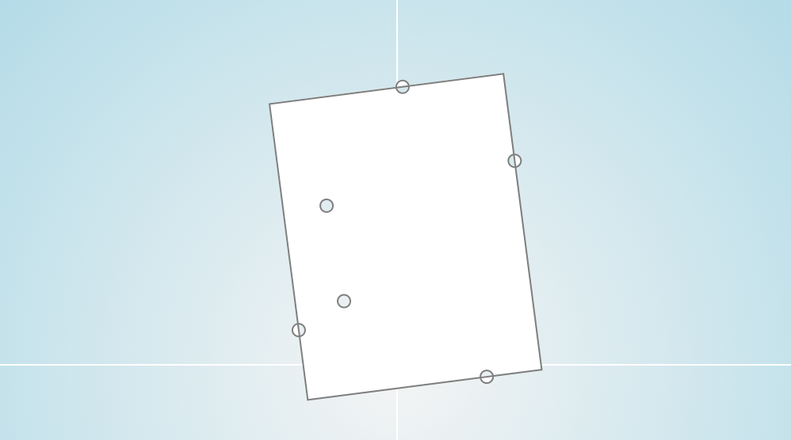
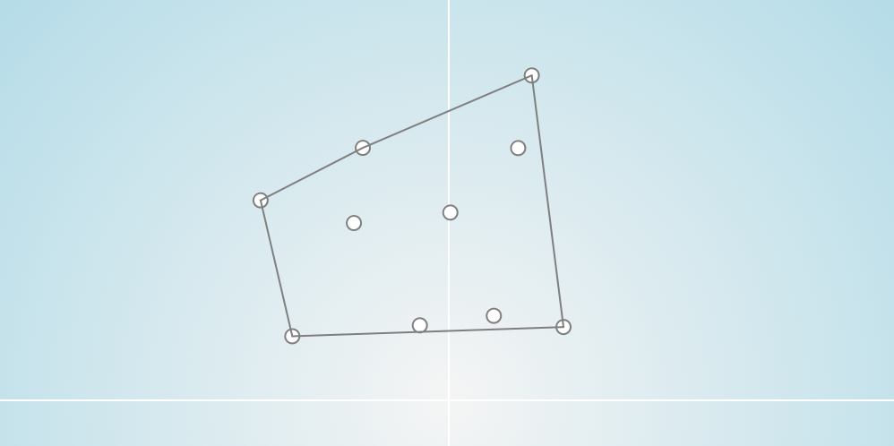

## Long Live The Square (LLTS)
An algorithm to find the arbitrarily oriented minimum bounding box in `R²`.

### What is a minimum bounding box?
A [minimum bounding box][1] is a rectangle that encloses all points in a given set of points and has the smallest area of all enclosing rectangles (*Figure 1*).


*Figure 1: Minimal Bounding Box*

### How does it work?
The **input** of the algorithm is a **set of points** which are described through a 2d position vector. To decrease the amount of points to process it is advisable to calculate the **convex hull** first.

#### Convex Hull

The [convex hull][2] is a set of points which are the most outtest points of the input set (*Figure 2*). It is like if you would put a rubber band around the points and take the ones which come in contact with it.

LLTS uses the [monotone chain algorithm][3] to calculate the convex hull. This algorithm first sorts the points [lexicographically][4] and then runs through the upper and lower most points to create the upper and lower hull. Those two combined is the convex hull.


*Figure 2: Convex Hull*

The monotone convex hull algorithm runs with `O(n * log(n))` speed.

#### Minimal Bounding Box
The idea of the LLTS algorithm is to use the property that one edge of the minimum bounding box is **parallel** to an edge of the convex hull.

So first of all the algorithm **connects** all points of the convex hull together to a list of segments.

Because it is more trivial to find the axis aligned bounding box then the arbitrarily oriented we rotate all points to be parallel to the **x-axis** with our **segment**. This can be achived with a rotation matrix and a bit of trigonometry:

```cs
// get angle of segment s
var delta = s.A - s.B;
var angle = -Math.Atan (delta.Y / delta.X);

// rotate vector v
var newX = v.X * Math.Cos (angle) - v.Y * Math.Sin (angle);
var newY = v.X * Math.Sin (angle) + v.Y * Math.Cos (angle);

return new Vector2d (newX, newY);
```

Now for each segment it tries to find the topmost and bottommost **y-value** and the leftmost and rightmost **x-value**. With these four values it is possible to create a bounding box in the rotated coordination system.

To find the minimal bounding box the algorithm now just takes the bounding box with the smallest **area**. It is not necessary to rotate the bounding box edge points back to calculate the **area** because it is not affected by rotational changes.

After cycling through every segment it just rotates back the four points of this bounding box and returns them.

#### Edge Cases
* If there are only one or zero points in the input set the algorithm just returns the set as it is.
* If two points are on the exact same place they will be counted as one point.

### Example Application
The example application is written in C# with the ui framework [Eto.Forms][5] to be platform independent. The project solution is a Visual Studio project and can be opend with [Visual Studio][7], [Xamarin Studio][6] or [Monodevelop][8]. To start it just run the project for your specific platform:

* Windows
 * WPF
 * WinForms
* Mac
 * MonoMac
 * XamarinMac
* Linux
 * Gtk2
 * Gtk3


*Figure 3: Example Application*

#### Functions
The UI (*Figure 3*) does contain following functions:

* To **add new points** just left click on the drawing pane.
* To **zoom** in and out use the mousewheel (like scrolling).
* To reset the pane click the **Reset** button.
* To add 20 random points click the **Random** button.
* To calculate and show the convex hull click the **Convex Hull** button.
* To calculate and show the minimum bounding box click the **Bounding Box** button.

### About
* *Copyright (c) 2016 Florian Bruggisser*
* *[MIT License](LICENSE)*

[1]: https://en.wikipedia.org/wiki/Minimum_bounding_box "Minimum Bounding Box"
[2]: https://en.wikipedia.org/wiki/Convex_hull "Convex Hull"
[3]: https://en.wikibooks.org/wiki/Algorithm_Implementation/Geometry/Convex_hull/Monotone_chain "Monotone Chain Convex Hull"
[4]: https://en.wikipedia.org/wiki/Lexicographical_order "Lexicographical Order"
[5]: https://github.com/picoe/Eto "Eto Forms"
[6]: https://xamarin.com/studio "Xamarin Studio"
[7]: https://www.visualstudio.com/ "Visual Studio"
[8]: http://www.monodevelop.com/ "Monodevelop"
